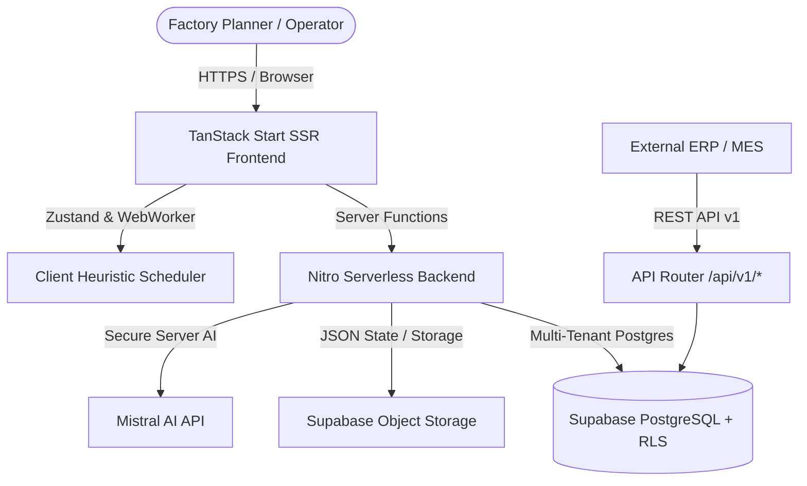

# CapaSolve — Industrial Production Scheduling & Capacity Planning SaaS

[](https://www.typescriptlang.org/)
[](https://react.dev/)
[](https://tanstack.com/start)
[](https://tailwindcss.com/)
[](https://supabase.com/)

**CapaSolve** is an advanced, full-stack Manufacturing Execution & Finite Capacity Scheduling SaaS platform. It enables discrete manufacturers, machine shops, and industrial plants to ingest ERP work orders, clean dirty production data, simulate bottleneck scenarios, optimize machine schedules, and dispatch shop-floor operations with sub-minute precision.

---

## 📌 Table of Contents

- [Key Capabilities & Modules](#-key-capabilities--modules)
- [System Architecture](#-system-architecture)
- [Technology Stack](#-technology-stack)
- [Repository Structure](#-repository-structure)
- [Quick Start Guide](#-quick-start-guide)
- [Environment Configuration](#-environment-configuration)
- [Database Schema & Migrations](#-database-schema--migrations)
- [REST API Reference](#-rest-api-reference)
- [Production Deployment](#-production-deployment)
- [Security Architecture](#-security-architecture)

---

## 🚀 Key Capabilities & Modules

### 1. ⏱️ Finite Capacity Scheduling Engine
- **Heuristic Optimization Modes**: Full optimization, Pre-scheduling, and Workstation-level scheduling.
- **Resource Constraints**: Distinct modeling for **dedicated setup technicians (Setters)** vs. **machine operators**, preventing over-utilization during tool changeovers.
- **SOP Deadline Adherence**: Automatic preponement window calculations and late order flags.
- **Sequence Dependencies**: Enforces strict operation ordering ($10 \rightarrow 20 \rightarrow 30$) while allowing concurrent non-conflicting machine lines.

### 2. 🤖 Industrial AI Assistant & What-If Simulations
- **Root Cause & Bottleneck Diagnostics**: Powered by Mistral AI via secure server functions (`createServerFn`), with automatic fallback to an offline heuristic analyzer.
- **Dynamic Scenario Simulations**:
  - *Unplanned Machine Breakdown* (downtime shift & rerouting).
  - *Staffing Shortage* (automatic switch to Operator Self-Setup mode).
  - *Rush Order Insertion* (pre-emption and priority fast-tracking).
  - *Shift & Overtime Extensions*.

### 3. 📊 Visual Timeline & Interactive Gantt Chart
- Drag-and-drop interactive dispatching with real-time collision detection.
- Multi-machine group views with day, week, and monthly zoom granularities.
- Work center capacity heatmaps and bottleneck indicators.

### 4. 🧹 ERP Data Cleaning & Ingestion Hub
- Intelligent CSV and Excel format parser with auto-column mapping (supports SAP, ProAlpha, JobBOSS, Infor, and custom ERP exports).
- Multi-language column header detection (English & German manufacturing terms).
- Real-time validation checks for negative cycle times, missing materials, and duplicate process steps.

### 5. ⚙️ Setup Changeover Matrix
- Sequence-dependent changeover rules based on material and tooling transitions.
- Minimizes non-productive setup downtime by batching compatible work orders.

### 6. 🏭 Shop Floor Execution & OEE Tracking
- Work order execution logging: actual completed units vs. defect/scrap units.
- Actual setup and runtime recording to compute true **Overall Equipment Effectiveness (OEE)**.

---

## 🏗️ System Architecture



---

## 💻 Technology Stack

| Layer | Technologies |
| :--- | :--- |
| **Frontend Framework** | [React 19](https://react.dev/), [TanStack Start](https://tanstack.com/start), [TanStack Router](https://tanstack.com/router), [TanStack Query](https://tanstack.com/query) |
| **Styling & Components**| [Tailwind CSS v4](https://tailwindcss.com/), [Radix UI](https://www.radix-ui.com/), [Lucide Icons](https://lucide.dev/), [Sonner](https://sonner.emilkowal.ski/) |
| **Data & State** | [Zustand](https://github.com/pmndrs/zustand), [PapaParse](https://www.papaparse.com/), [Date-fns](https://date-fns.org/) |
| **Server & Bundling** | [Vite 7](https://vitejs.dev/), [Nitro Serverless](https://nitro.unjs.io/) |
| **Backend & DB** | [Supabase](https://supabase.com/) (PostgreSQL 15+, Row-Level Security, Auth, Storage) |
| **AI Integration** | [Mistral AI](https://mistral.ai/) via secure server-side execution |

---

## 📂 Repository Structure

```
schedulersaas/
├── supabase/
│   └── migrations/
│       ├── 20260723000000_init_schema.sql         # Base tables & initial schema
│       ├── 20260727_master_schema.sql             # Multi-tenant RLS, schedules, machines
│       └── 20260802_next_level_features.sql       # Execution logs, matrix rules, audit
├── flow-sync-saas/                                # Main Application Workspace
│   ├── src/
│   │   ├── api/                                   # REST API endpoints (/api/v1/*)
│   │   │   ├── capacity/                          # Workstation capacity APIs
│   │   │   ├── machines/                          # Machine group registry APIs
│   │   │   ├── schedules/                         # Solve & dispatch APIs
│   │   │   └── router.ts                          # API key middleware & rate limiter
│   │   ├── components/                            # Reusable UI & Modal components
│   │   │   ├── modals/                            # Work order & simulation modals
│   │   │   ├── ui/                                # Radix UI component primitives
│   │   │   ├── AppLayout.tsx                      # Dashboard navigation shell
│   │   │   ├── DataCleaningHub.tsx                # ERP CSV transformation interface
│   │   │   ├── GanttTimelineView.tsx              # Interactive timeline canvas
│   │   │   └── ThemeProvider.tsx                  # Light / Dark theme controller
│   │   ├── lib/                                   # Core Business Logic & Solvers
│   │   │   ├── ai-service.ts                      # Server-side AI assistant engine
│   │   │   ├── auth-service.ts                    # Supabase Auth integration
│   │   │   ├── dataCleaner.ts                     # Heuristic CSV anomaly cleaner
│   │   │   ├── db-service.ts                      # Supabase PostgreSQL connectors
│   │   │   ├── scheduler.ts                       # Finite capacity scheduling algorithms
│   │   │   ├── solver.worker.ts                   # Web Worker for non-blocking solving
│   │   │   └── store.ts                           # Global Zustand application store
│   │   ├── routes/                                # TanStack Router file-based routes
│   │   │   ├── __root.tsx                         # Root shell & auth guards
│   │   │   ├── dashboard.tsx                      # Main KPIs & schedule workspace
│   │   │   ├── capacity.tsx                       # Machine utilization & workcenter loads
│   │   │   ├── monthly.tsx                        # Monthly master calendar
│   │   │   ├── pivot.tsx                          # Multi-dimensional analytics pivot
│   │   │   └── sandbox.tsx                        # What-If scenario simulation lab
│   │   ├── styles.css                             # Tailwind CSS tokens
│   │   └── server.ts                              # Nitro SSR production entrypoint
│   ├── package.json
│   ├── tsconfig.json
│   └── vite.config.ts                             # Production Vite + Nitro build config
└── README.md
```

---

## ⚡ Quick Start Guide

### Prerequisites
- **Node.js**: v18.0.0 or higher
- **Package Manager**: `npm`, `pnpm`, or `bun`

### 1. Clone the Repository
```bash
git clone https://github.com/rajeetcodeN/schedulersaas-.git
cd schedulersaas/flow-sync-saas
```

### 2. Install Dependencies
```bash
npm install
```

### 3. Configure Environment Variables
Copy `.env.example` to `.env`:
```bash
cp .env.example .env
```
Fill in your Supabase credentials (see [Environment Configuration](#-environment-configuration)).

### 4. Run Development Server
```bash
npm run dev
```
Open [http://localhost:8080](http://localhost:8080) to access the application.

---

## 🔑 Environment Configuration

Create a `.env` file in `flow-sync-saas/`:

```ini
# Supabase Configuration
VITE_SUPABASE_PROJECT_ID=your-project-id
VITE_SUPABASE_ANON_KEY=your-supabase-anon-key
SUPABASE_PROJECT_ID=your-project-id
SUPABASE_ANON_KEY=your-supabase-anon-key
SUPABASE_BUCKET_NAME=scheduler

# Industrial AI Assistant (Server-only secret)
MISTRAL_API_KEY=your-mistral-api-key
MISTRAL_MODEL=mistral-small-latest

# Environment Mode
NODE_ENV=development
```

> [!NOTE]
> `MISTRAL_API_KEY` is kept strictly server-side and is never exposed to client browser bundles.

---

## 🗄️ Database Schema & Migrations

The database is built on PostgreSQL with Supabase Row-Level Security (RLS) ensuring strict multi-tenant isolation.

To apply database tables and policies:
1. Open your **Supabase Dashboard** $\rightarrow$ **SQL Editor**.
2. Run the migration scripts located in `supabase/migrations/` in order:
   - `20260723000000_init_schema.sql`
   - `20260727_master_schema.sql`
   - `20260802_next_level_features.sql`
3. In **Supabase Storage**, create a bucket named `scheduler` with Private access.

---

## 🌐 REST API Reference

The backend provides authenticated REST API endpoints for external ERP/MES integrations:

| Method | Endpoint | Description |
| :--- | :--- | :--- |
| `POST` | `/api/v1/schedule/solve` | Dispatches orders through the solver engine and returns optimized timeline slots. |
| `GET` | `/api/v1/orders` | Retrieves active work orders. |
| `POST` | `/api/v1/orders` | Ingests new work orders into the queue. |
| `DELETE` | `/api/v1/orders/:id` | Cancels or removes an active work order. |

**Authentication Header**:
```http
X-API-Key: cs_live_your_api_key_here
```

---

## 🚢 Production Deployment

### Building the Application
```bash
npm run build
```
This produces an optimized client bundle and Vercel/Nitro serverless outputs in `.vercel/output`.

### Deploying to Vercel
1. Push your changes to GitHub.
2. Import the repository in **Vercel** with Root Directory set to `flow-sync-saas`.
3. Add the production environment variables from `.env`.
4. Deploy!

### Previewing the Production Build Locally
```bash
npm run preview
```

---

## 🛡️ Security Architecture

- **Row-Level Security (RLS)**: Users can only access data belonging to their provisioned organization.
- **Role-Based Access Control (RBAC)**: Supports `ADMIN`, `DEVELOPER`, and `GUEST` roles.
- **Server Functions**: Sensitive operations (AI calls, file persistence, DB mutations) run within isolated `createServerFn` handlers.
- **Zero Third-Party Vendor Lock-In**: Standard Vite + Nitro bundling without proprietary wrapper dependencies.

---

## 📄 License

Proprietary — All rights reserved. Designed for industrial manufacturing scheduling and shop-floor execution.

