# CapaSolve — Actual Code Architecture Deep-Dive

How every part of the scheduler, optimizer, capacity planner, and charts actually works at the code level.

---

## Complete Data Flow

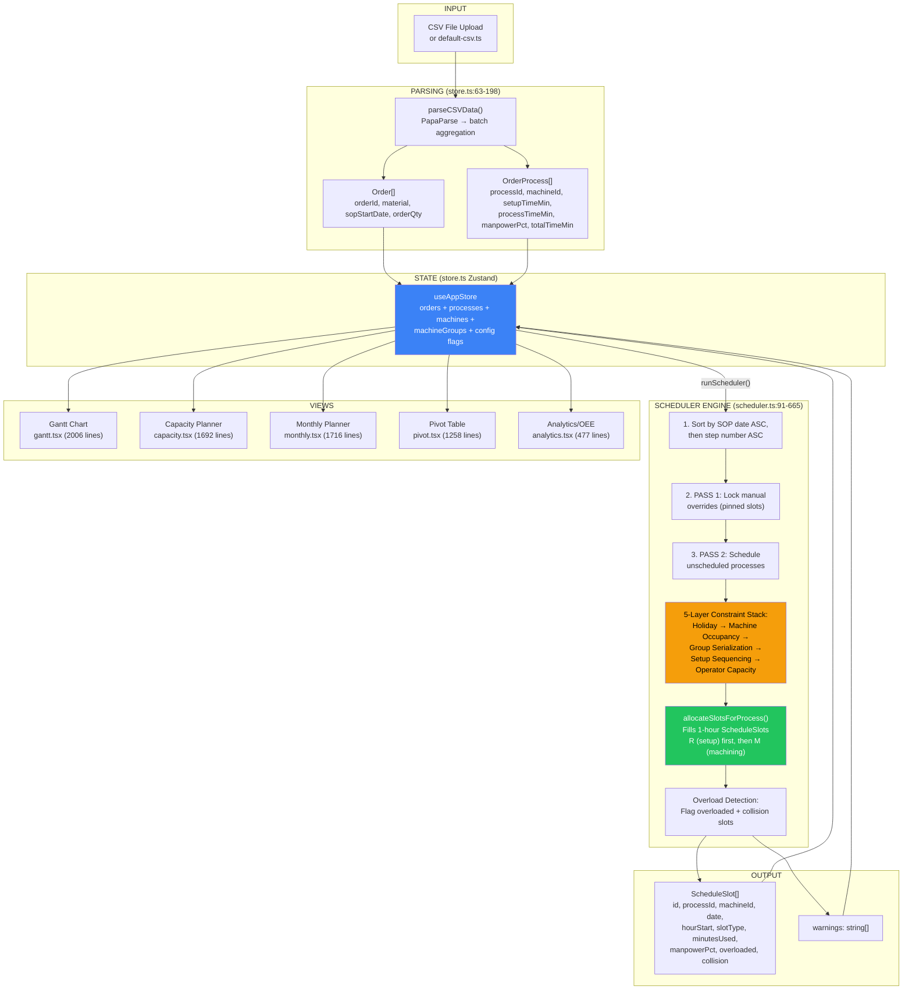

---

## 1. CSV Parsing Pipeline

**File:** [store.ts:63-198](file:///d:/schedulersaas/flow-sync-saas/src/lib/store.ts#L63-L198) — `parseCSVData()`

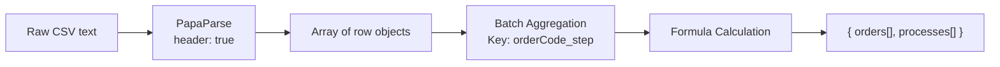

### What happens step by step:

1. **PapaParse** reads CSV with `header: true, skipEmptyLines: true`
2. **Batch aggregation** — Groups rows by `${orderCode}_${step}`. If the same order+step appears multiple times, quantities are **summed** and the **earliest SOP date** is kept
3. **Formula calculation** for each process:

| Field          | Formula                                       | Code Location                                                                 |
| -------------- | --------------------------------------------- | ----------------------------------------------------------------------------- |
| `sumV2`        | `(orderQty / baseQty) × processTimeMin`       | [store.ts:171](file:///d:/schedulersaas/flow-sync-saas/src/lib/store.ts#L171) |
| `sumV3`        | `manpowerUtilizationMin × baseQty × orderQty` | [store.ts:172](file:///d:/schedulersaas/flow-sync-saas/src/lib/store.ts#L172) |
| `manpowerPct`  | `manpowerUtilizationMin / processTimeMin`     | [store.ts:173](file:///d:/schedulersaas/flow-sync-saas/src/lib/store.ts#L173) |
| `totalTimeMin` | `setupTimeMin + sumV2`                        | [store.ts:174](file:///d:/schedulersaas/flow-sync-saas/src/lib/store.ts#L174) |

### Example:

```
Order=1023811, Step=40, OrderQty=104, BaseQty=3
SetupTime=30min, ProcessTime=5min, ManpowerUtil=1.95

sumV2 = (104/3) × 5 = 173.33 min
totalTimeMin = 30 + 173.33 = 203.33 min ← total time to schedule
manpowerPct = 1.95/5 = 0.39 ← 39% operator load during machining
```

---

## 2. The Scheduler Engine — How It Actually Works

**File:** [scheduler.ts:91-665](file:///d:/schedulersaas/flow-sync-saas/src/lib/scheduler.ts#L91-L665) — `generateSchedule()`

### Input Parameters

```typescript
generateSchedule(
  orders, // Order[] — SOP dates, quantities
  processes, // OrderProcess[] — steps with time calculations
  machines, // Machine[] — {id, machineGroupId}
  optimizeMode, // "pre" | "workstation" | "full"
  groupSerialization, // boolean — serialize within machine group?
  allowProcessOverlap, // boolean — allow parallel M-slots in same group?
  allowSopOverride, // boolean — can schedule before SOP date?
  maxUtilizeResources, // boolean — auto-reassign to fastest available machine?
  dailyCapacities, // Record<date, {setter%, process%, isHoliday?}>
  globalSetterCapacity, // default setter % (100 = 1 FTE)
  globalOperatorCapacity, // default operator % (200 = 2 FTEs)
  maxPreponeWeeks, // max weeks to schedule before SOP
);
```

### Algorithm: 2-Pass Greedy Left-Shift Scheduling

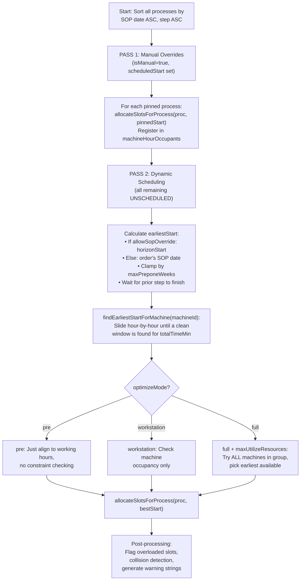

### The 5-Layer Constraint Stack

When `findEarliestStartForMachine()` searches for a valid window, it checks **each hour** against these constraints in order. If **any** constraint fails, it slides to the next hour.

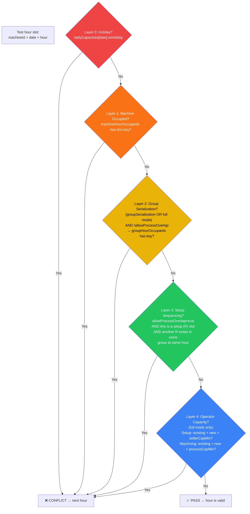

**Code location:** [scheduler.ts:379-458](file:///d:/schedulersaas/flow-sync-saas/src/lib/scheduler.ts#L379-L458)

### The 3 Optimization Modes — What Each Actually Does

| Mode              | Machine Check | Group Check                        | Operator Capacity Check | Machine Reassignment        | Code Path                                                                                                         |
| ----------------- | ------------- | ---------------------------------- | ----------------------- | --------------------------- | ----------------------------------------------------------------------------------------------------------------- |
| **`pre`**         | ❌            | ❌                                 | ❌                      | ❌                          | [L498-500](file:///d:/schedulersaas/flow-sync-saas/src/lib/scheduler.ts#L498-L500) — just `alignToWorkingHours()` |
| **`workstation`** | ✅ Layer 1    | ✅ Layer 2 (if groupSerialization) | ❌                      | ❌                          | [L494-497](file:///d:/schedulersaas/flow-sync-saas/src/lib/scheduler.ts#L494-L497)                                |
| **`full`**        | ✅ Layer 1    | ✅ Layer 2 (always)                | ✅ Layer 4              | ✅ (if maxUtilizeResources) | [L475-497](file:///d:/schedulersaas/flow-sync-saas/src/lib/scheduler.ts#L475-L497)                                |

### `full` + `maxUtilizeResources` — Machine Reassignment Logic

```typescript
// scheduler.ts:475-497
if (optimizeMode === "full" && maxUtilizeResources && mGroupId) {
  // Try ALL machines in the same group
  const groupMachines = machines.filter((m) => m.machineGroupId === mGroupId);

  let bestMachineId = proc.machineId; // default: CSV-assigned machine
  let earliestMachineStart = findEarliestStartForMachine(proc.machineId);

  for (const candMachine of groupMachines) {
    const candStart = findEarliestStartForMachine(candMachine.id);
    if (candStart < earliestMachineStart) {
      // earlier = better
      earliestMachineStart = candStart;
      bestMachineId = candMachine.id; // reassign!
    }
  }

  proc.machineId = bestMachineId; // override original assignment
}
```

**What this means:** If machine `603011` (from CSV) is busy until hour 14, but `603010` (same group M2) is free at hour 8, the process gets moved to `603010`. The `originalMachineId` field preserves the CSV value.

---

## 3. Slot Allocation — How Time Gets Filled

**File:** [scheduler.ts:189-304](file:///d:/schedulersaas/flow-sync-saas/src/lib/scheduler.ts#L189-L304) — `allocateSlotsForProcess()`

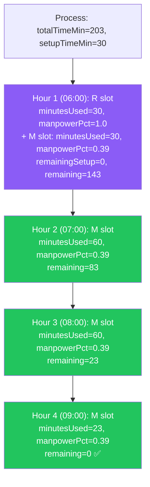

**Key rules:**

- Setup (R) is always consumed **first** — before any machining
- R slots always have `manpowerPct=1.0` (100% operator attention)
- M slots use the process's calculated `manpowerPct` (e.g., 0.39)
- Within a single hour, **both R and M** can coexist (e.g., 30min R + 30min M)
- Each slot blocks the machine for that hour via `registerMachineHour()`

---

## 4. Capacity System — Two Global Resource Pools

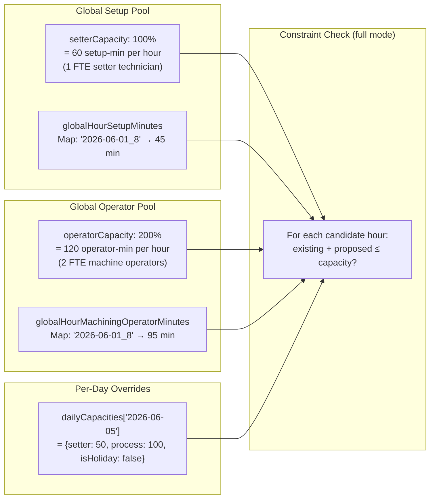

### Capacity math per hour:

```
setterCapMin = (dayCap.setter / 100) × 60
             = (100 / 100) × 60 = 60 min/hour

processCapMin = (dayCap.process / 100) × 60
              = (200 / 100) × 60 = 120 operator-min/hour
```

**Code:** [scheduler.ts:420-452](file:///d:/schedulersaas/flow-sync-saas/src/lib/scheduler.ts#L420-L452)

If `existingSetup + newSetup > 60 min` → conflict, try next hour.  
If `existingOpMin + (machMins × manpowerPct) > 120 min` → conflict, try next hour.

---

## 5. The Store — How It Orchestrates Everything

**File:** [store.ts:557-633](file:///d:/schedulersaas/flow-sync-saas/src/lib/store.ts#L557-L633) — `runScheduler()`

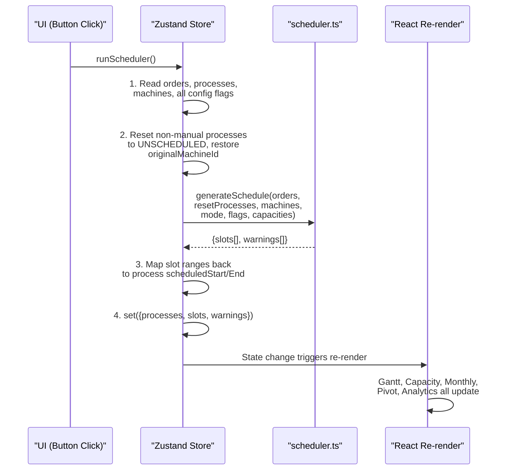

### What triggers `runScheduler()`:

Every state change that affects scheduling automatically re-runs it:

| Trigger                     | Store Method                  | Calls runScheduler?         |
| --------------------------- | ----------------------------- | --------------------------- |
| Change optimization mode    | `setOptimizationMode()`       | ✅ Yes                      |
| Toggle group serialization  | `setGroupSerialization()`     | ✅ Yes                      |
| Toggle process overlap      | `setAllowProcessOverlap()`    | ✅ Yes                      |
| Toggle SOP override         | `setAllowSopOverride()`       | ✅ Yes                      |
| Toggle max utilize          | `setMaxUtilizeResources()`    | ✅ Yes                      |
| Change setter capacity      | `setGlobalSetterCapacity()`   | ✅ Yes                      |
| Change operator capacity    | `setGlobalOperatorCapacity()` | ✅ Yes                      |
| Set daily capacity override | `setDailyCapacity()`          | ✅ Yes                      |
| Set max prepone weeks       | `setMaxPreponeWeeks()`        | ✅ Yes                      |
| Remove an order             | `removeOrder()`               | ✅ Yes                      |
| Import CSV                  | `loadFromCSVText()`           | ✅ Yes                      |
| Drag-drop a slot            | `updateSlotSchedule()`        | ✅ Yes (pins process first) |
| Reset process to auto       | `resetProcessToAuto()`        | ✅ Yes                      |
| Pin a process               | `pinProcessSchedule()`        | ✅ Yes                      |

---

## 6. Gantt Chart — How It Renders

**File:** [gantt.tsx](file:///d:/schedulersaas/flow-sync-saas/src/routes/gantt.tsx) — 2006 lines

### Data Pipeline:

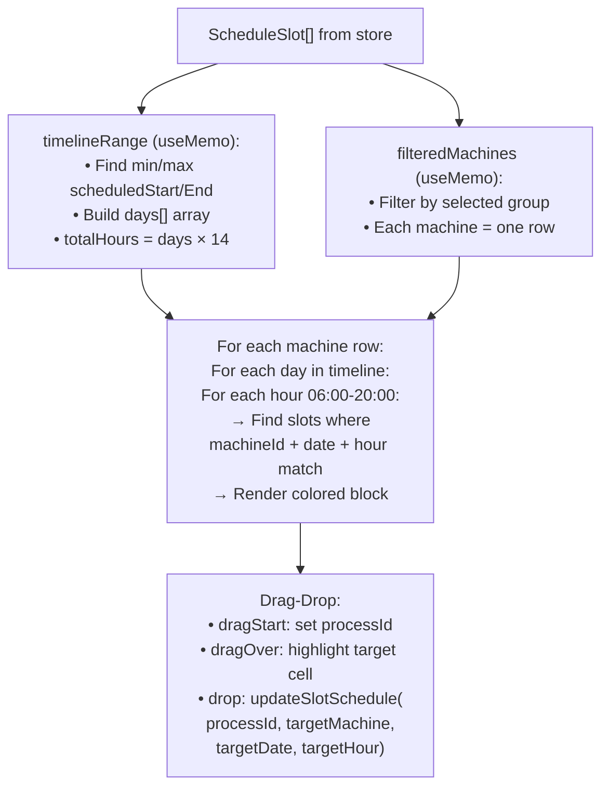

### How slot blocks are rendered:

```
Each slot becomes a colored <div>:
- R (setup) = purple/violet background
- M (machining) = green/blue background
- overloaded = red border
- collision = red pulsing background
- Width = HOUR_WIDTH (45px per hour)
- Height proportional to minutesUsed/60
```

### Zoom levels: `YEAR → WEEK → DAY → HOUR`

| Level | What shows                                      | Column width |
| ----- | ----------------------------------------------- | ------------ |
| YEAR  | Months as columns, order blocks spanning months | Compressed   |
| WEEK  | 7 days, each day = 14 hour columns              | 45px/hour    |
| DAY   | Single day, 14 hour columns                     | 45px/hour    |
| HOUR  | Single hour detail popup                        | Full width   |

---

## 7. Capacity Chart — How It Builds Data

**File:** [capacity.tsx:322-389](file:///d:/schedulersaas/flow-sync-saas/src/routes/capacity.tsx#L322-L389) — `hourlyChartData` (useMemo)

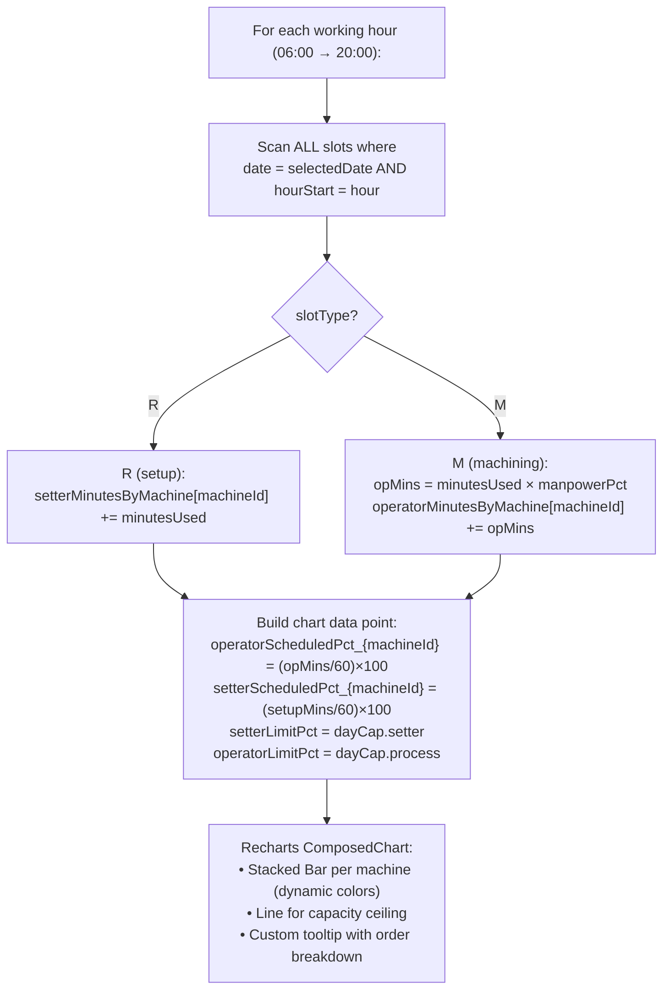

### Chart structure:

- **X-axis:** Hours (06:00 to 20:00)
- **Y-axis:** Operator/Setter load as % (0-200%+)
- **Bars:** Stacked per machine — each machine gets a separate `<Bar>` with unique color
- **Line:** Capacity ceiling line (100% for setter, 200% for operator)
- **Toggle:** Switch between "operator" and "setter" view via `chartRole` state
- **Filter:** Filter by machine group or individual machine via `chartMachineFilter`

---

## 8. Capacity Planner Day View — Pivot Table

**File:** [capacity.tsx:392-454](file:///d:/schedulersaas/flow-sync-saas/src/routes/capacity.tsx#L392-L454) — `dayPivotMatrix`

```
Structure: Record<machineId, Record<hour, {r, m, p}>>

r = total R (setup) minutes in that cell
m = total M (machining) minutes in that cell
p = operator-minutes = m × manpowerPct

Rows: machines (grouped by machineGroup)
Columns: hours (06-20)
Cells: R min / M min / Operator-min
```

Also provides:

- **Group subtotals** per hour: `getGroupSubtotalHourly(groupId, hour)`
- **Grand totals** per hour: `getGrandTotalHourly(hour)`

---

## 9. Monthly Planner — How It Works

**File:** [monthly.tsx](file:///d:/schedulersaas/flow-sync-saas/src/routes/monthly.tsx) — 1716 lines

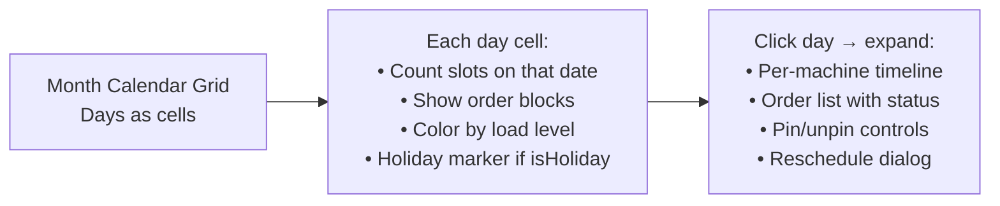

Key features:

- Calendar navigation (month/year)
- Order blocks spanning multiple days
- Holiday toggle per day → writes to `dailyCapacities[date].isHoliday`
- Capacity override editing per day
- Search/filter by order, machine, status

---

## 10. Pivot Table — Three Views

**File:** [pivot.tsx](file:///d:/schedulersaas/flow-sync-saas/src/routes/pivot.tsx) — 1258 lines

| Tab             | What It Shows                                                                                    | Data Source                              |
| --------------- | ------------------------------------------------------------------------------------------------ | ---------------------------------------- |
| **Raw**         | Every process with all fields (orderId, material, setup, process time, SOP, scheduled start/end) | `processes[]` + `orders[]`               |
| **Grouped**     | Aggregated by machine group → machine → order, with totals                                       | `processes[]` grouped                    |
| **Load Matrix** | Machines × Dates grid, each cell = total minutes scheduled                                       | `slots[]` aggregated by machineId + date |

---

## 11. Analytics / OEE Dashboard

**File:** [analytics.tsx](file:///d:/schedulersaas/flow-sync-saas/src/routes/analytics.tsx) — 477 lines

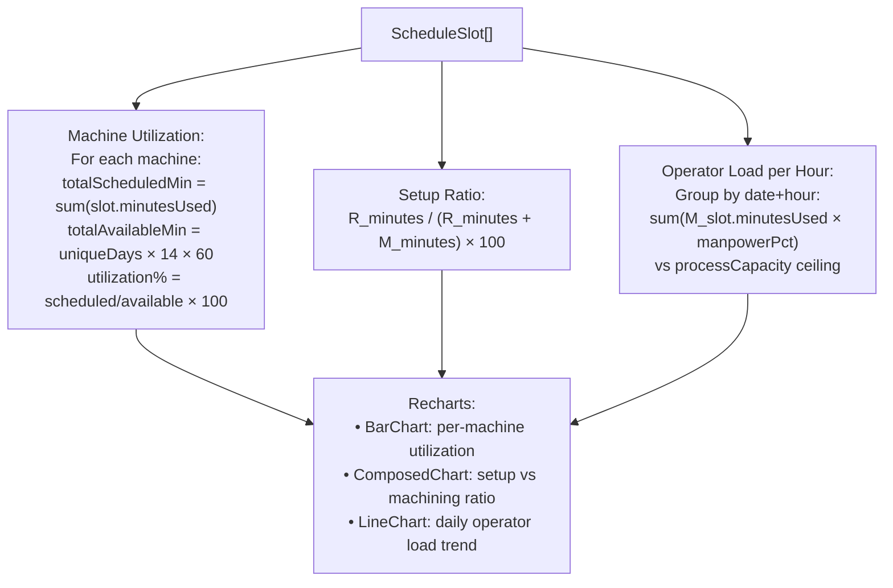

---

## 12. Warning & Overload Detection

**File:** [scheduler.ts:505-651](file:///d:/schedulersaas/flow-sync-saas/src/lib/scheduler.ts#L505-L651)

After all slots are allocated, 3 types of warnings are generated:

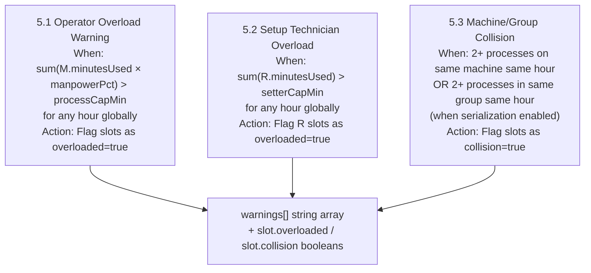

---

## 13. Manual Override & Drag-Drop System

**File:** [store.ts:635-722](file:///d:/schedulersaas/flow-sync-saas/src/lib/store.ts#L635-L722)

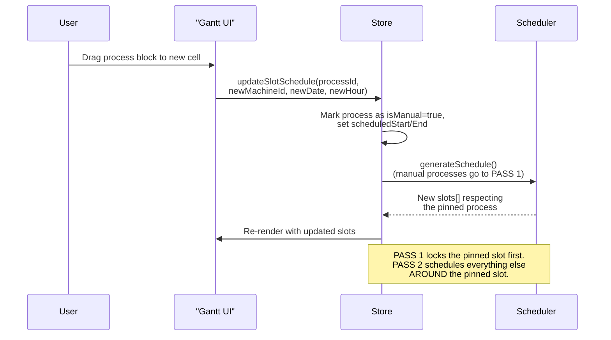

### The pin/unpin cycle:

1. **Drag-drop** → `updateSlotSchedule()` → sets `isManual=true`
2. **Pin button** → `pinProcessSchedule()` → sets `isManual=true` on current position
3. **Reset to auto** → `resetProcessToAuto()` → sets `isManual=false`, restores `originalMachineId`
4. All three trigger `runScheduler()` which re-runs the full 2-pass algorithm

---

## Summary: What Each File Does

| File                                                                                              | Role                          | Lines | Key Function                                                   |
| ------------------------------------------------------------------------------------------------- | ----------------------------- | ----- | -------------------------------------------------------------- |
| [types.ts](file:///d:/schedulersaas/flow-sync-saas/src/lib/types.ts)                              | Data model definitions        | 70    | Type interfaces + shift constants                              |
| [store.ts](file:///d:/schedulersaas/flow-sync-saas/src/lib/store.ts)                              | Central state + orchestration | 845   | `runScheduler()`, `parseCSVData()`, cloud sync                 |
| [scheduler.ts](file:///d:/schedulersaas/flow-sync-saas/src/lib/scheduler.ts)                      | Constraint solver engine      | 665   | `generateSchedule()`, `allocateSlotsForProcess()`              |
| [dataCleaner.ts](file:///d:/schedulersaas/flow-sync-saas/src/lib/dataCleaner.ts)                  | CSV validation & cleaning     | 719   | `validateCSVData()`, `cleanCSVData()`, `detectColumnMapping()` |
| [gantt.tsx](file:///d:/schedulersaas/flow-sync-saas/src/routes/gantt.tsx)                         | Interactive Gantt timeline    | 2,006 | Drag-drop scheduling, multi-zoom, machine rows                 |
| [capacity.tsx](file:///d:/schedulersaas/flow-sync-saas/src/routes/capacity.tsx)                   | Day-level capacity planner    | 1,692 | Calendar, capacity config, stacked bar chart, pivot            |
| [monthly.tsx](file:///d:/schedulersaas/flow-sync-saas/src/routes/monthly.tsx)                     | Month calendar planner        | 1,716 | Calendar grid, order blocks, holiday management                |
| [pivot.tsx](file:///d:/schedulersaas/flow-sync-saas/src/routes/pivot.tsx)                         | Tabular data views            | 1,258 | Raw/Grouped/Load Matrix tabs                                   |
| [analytics.tsx](file:///d:/schedulersaas/flow-sync-saas/src/routes/analytics.tsx)                 | OEE/utilization dashboard     | 477   | Machine util, setup ratio, operator load charts                |
| [DataCleaningHub.tsx](file:///d:/schedulersaas/flow-sync-saas/src/components/DataCleaningHub.tsx) | CSV cleaning wizard UI        | 1,357 | 4-step workflow: Upload → Validate → Clean → Import            |
| [default-csv.ts](file:///d:/schedulersaas/flow-sync-saas/src/lib/default-csv.ts)                  | Built-in sample dataset       | 23KB  | Hardcoded CSV for demo                                         |
| [translations.ts](file:///d:/schedulersaas/flow-sync-saas/src/lib/translations.ts)                | i18n dictionary               | 13KB  | EN + DE translations                                           |
