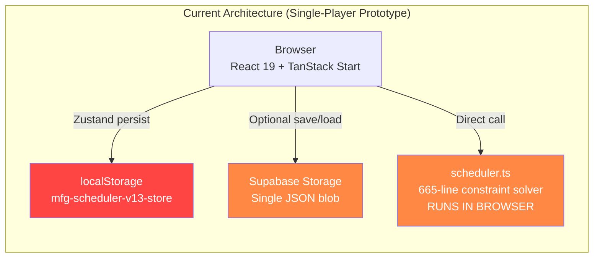
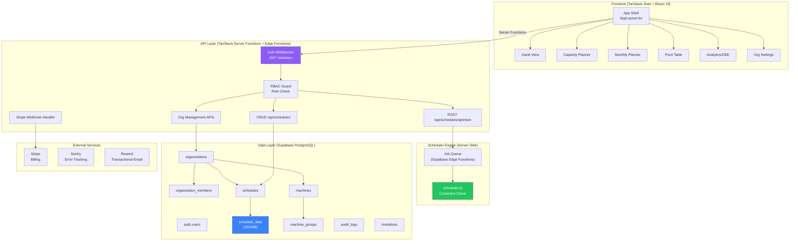
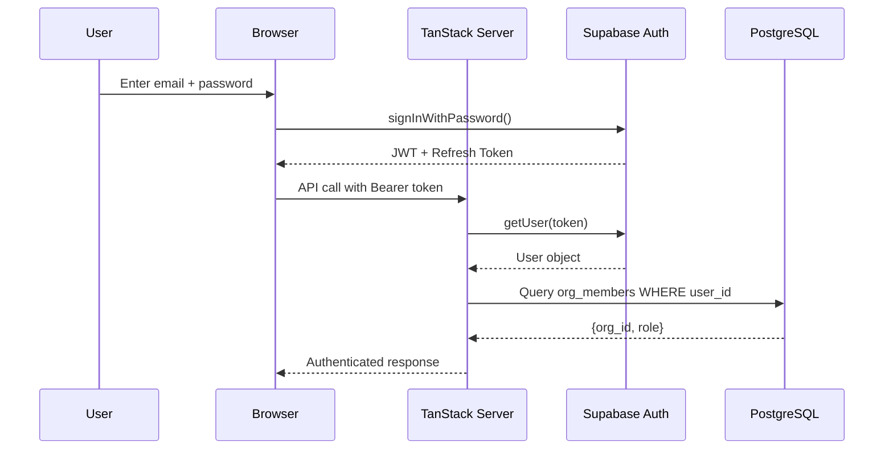
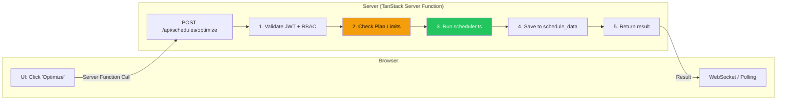
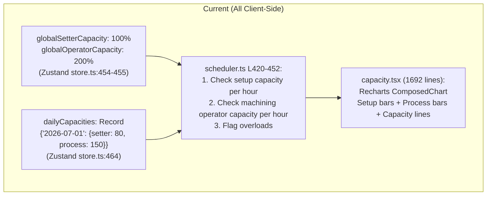
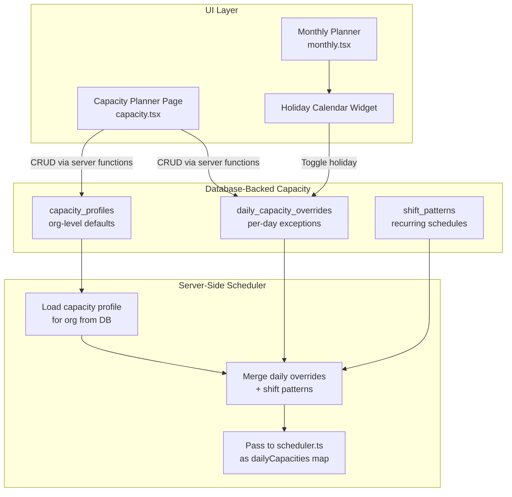
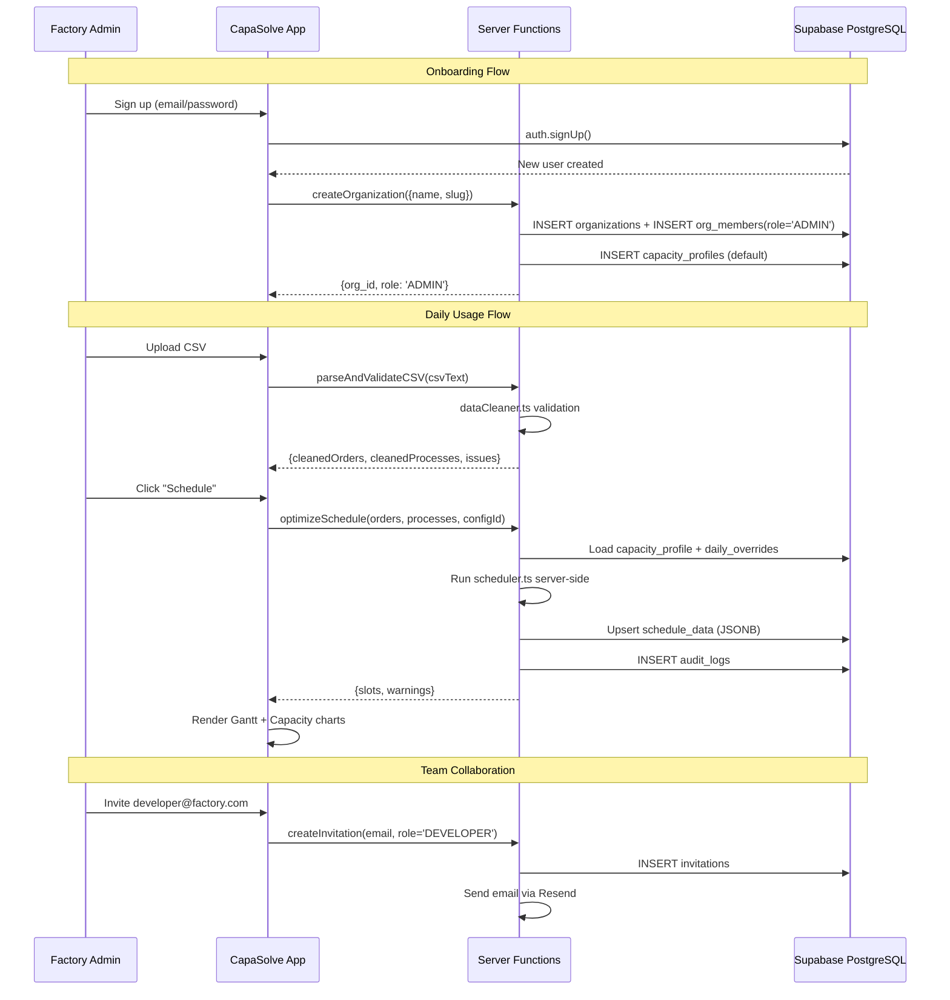

# CapaSolve SaaS — Full Architecture & Transformation Plan

## Executive Summary

After auditing all **93 files / 1016 symbols** across the SchedulerSaaS codebase, this plan details the **complete architecture** needed to transform the current prototype into a production-grade, multi-tenant SaaS product. The plan covers every layer — from database schema to scheduler engine to UI customization — with exact file-level changes and a phased delivery roadmap.

---

## Current State Assessment

### What You Have (Prototype Score: 22/100 SaaS-Ready)



| Component | File | Lines | Status |
|---|---|---:|---|
| Scheduling Engine | [scheduler.ts](file:///d:/schedulersaas/flow-sync-saas/src/lib/scheduler.ts) | 665 | ✅ Working, but client-side only |
| State Management | [store.ts](file:///d:/schedulersaas/flow-sync-saas/src/lib/store.ts) | 845 | ⚠️ localStorage-first, no DB |
| Gantt Chart | [gantt.tsx](file:///d:/schedulersaas/flow-sync-saas/src/routes/gantt.tsx) | 2,006 | ✅ Feature-rich with drag-drop |
| Capacity Planner | [capacity.tsx](file:///d:/schedulersaas/flow-sync-saas/src/routes/capacity.tsx) | 1,692 | ✅ Charts + daily capacity config |
| Monthly Planner | [monthly.tsx](file:///d:/schedulersaas/flow-sync-saas/src/routes/monthly.tsx) | 1,716 | ✅ Monthly calendar view |
| Pivot Table | [pivot.tsx](file:///d:/schedulersaas/flow-sync-saas/src/routes/pivot.tsx) | 1,258 | ✅ Raw/grouped/load pivot |
| Analytics/OEE | [analytics.tsx](file:///d:/schedulersaas/flow-sync-saas/src/routes/analytics.tsx) | 477 | ✅ Charts + machine util |
| Data Cleaning | [dataCleaner.ts](file:///d:/schedulersaas/flow-sync-saas/src/lib/dataCleaner.ts) | 719 | ✅ CSV validation/AI suggestions |
| Data Cleaning UI | [DataCleaningHub.tsx](file:///d:/schedulersaas/flow-sync-saas/src/components/DataCleaningHub.tsx) | 1,357 | ✅ Full workflow wizard |
| Orders Management | [orders.tsx](file:///d:/schedulersaas/flow-sync-saas/src/routes/orders.tsx) | 507 | ✅ CRUD + import |
| Auth Pages | [login.tsx](file:///d:/schedulersaas/flow-sync-saas/src/routes/login.tsx) / [signup.tsx](file:///d:/schedulersaas/flow-sync-saas/src/routes/signup.tsx) | 628 | ⚠️ Supabase auth wired but simulated roles |
| Cloud Sync | [supabase.server.ts](file:///d:/schedulersaas/flow-sync-saas/src/lib/supabase.server.ts) | 117 | ⚠️ Has auth checks but uses Storage blobs |
| DB Schema | [init_schema.sql](file:///d:/schedulersaas/supabase/migrations/20260723000000_init_schema.sql) | 172 | ✅ Organizations, members, schedules, RLS |
| Type System | [types.ts](file:///d:/schedulersaas/flow-sync-saas/src/lib/types.ts) | 70 | ✅ Well-defined domain types |
| i18n | [translations.ts](file:///d:/schedulersaas/flow-sync-saas/src/lib/translations.ts) | 13,124 bytes | ✅ EN + DE |
| Marketing | Landing, Pricing, About, Contact | 4 pages | ✅ Professional |

### Key Findings

> [!IMPORTANT]
> The app already has **Supabase Auth wired** in login.tsx (real `signInWithPassword`) and a **proper DB schema** with RLS. The previous audit's "zero auth" assessment is outdated — you've made progress. But the **scheduler running client-side**, **no real DB persistence for schedule data**, and **no plan enforcement** remain critical gaps.

---

## Target Architecture



---

## Detailed Component Architecture

### 1. Authentication & Session Management



**Current state:** Login.tsx already calls `supabase.auth.signInWithPassword()` and fetches `organization_members`. This is **partially working**.

**What needs to change:**

| File | Change |
|---|---|
| [login.tsx](file:///d:/schedulersaas/flow-sync-saas/src/routes/login.tsx) | Remove simulated role fallback (lines 29-32). Make org membership lookup the single source of truth |
| [store.ts](file:///d:/schedulersaas/flow-sync-saas/src/lib/store.ts) | Remove hardcoded `role: "DEVELOPER"` default. Add `isAuthenticated` boolean |
| [__root.tsx](file:///d:/schedulersaas/flow-sync-saas/src/routes/__root.tsx) | Add `onAuthStateChange()` listener. Redirect to `/login` if no session |
| [NEW] `src/lib/auth-guard.ts` | Shared route guard utility for protected pages |
| [supabase.server.ts](file:///d:/schedulersaas/flow-sync-saas/src/lib/supabase.server.ts) | Already has auth checks ✅ — extend to all new server functions |

---

### 2. Database Schema (What Exists vs What's Needed)

**Already created in** [init_schema.sql](file:///d:/schedulersaas/supabase/migrations/20260723000000_init_schema.sql):
- ✅ `organizations` (id, name, slug, plan)
- ✅ `organization_members` (org_id, user_id, role)
- ✅ `schedules` (id, org_id, name, created_by)
- ✅ `schedule_data` (schedule_id, data JSONB)
- ✅ `audit_logs` (org_id, user_id, action, details)
- ✅ `invitations` (org_id, email, role, token, expires_at)
- ✅ RLS policies on all tables
- ✅ Helper functions: `get_user_role_in_org()`, `is_org_member()`

**What's still missing (new migration needed):**

```sql
-- Migration: 20260724000000_extend_schema.sql

-- Machine Groups (currently hardcoded in store.ts as SEED_GROUPS)
CREATE TABLE public.machine_groups (
    id UUID PRIMARY KEY DEFAULT gen_random_uuid(),
    org_id UUID REFERENCES public.organizations(id) ON DELETE CASCADE NOT NULL,
    code TEXT NOT NULL,        -- e.g. "M1", "M2"
    name TEXT NOT NULL,        -- e.g. "Milling Center 1"
    created_at TIMESTAMPTZ DEFAULT now() NOT NULL,
    UNIQUE (org_id, code)
);

-- Machines (currently hardcoded as SEED_MACHINES)
CREATE TABLE public.machines (
    id UUID PRIMARY KEY DEFAULT gen_random_uuid(),
    org_id UUID REFERENCES public.organizations(id) ON DELETE CASCADE NOT NULL,
    machine_group_id UUID REFERENCES public.machine_groups(id) ON DELETE CASCADE NOT NULL,
    code TEXT NOT NULL,        -- e.g. "603011"
    name TEXT NOT NULL,        -- e.g. "CNC Fräse 603011"
    is_active BOOLEAN DEFAULT true,
    created_at TIMESTAMPTZ DEFAULT now() NOT NULL,
    UNIQUE (org_id, code)
);

-- Capacity Profiles (currently globalSetterCapacity/globalOperatorCapacity in Zustand)
CREATE TABLE public.capacity_profiles (
    id UUID PRIMARY KEY DEFAULT gen_random_uuid(),
    org_id UUID REFERENCES public.organizations(id) ON DELETE CASCADE NOT NULL,
    name TEXT NOT NULL DEFAULT 'Default',
    setter_capacity_pct INTEGER NOT NULL DEFAULT 100,
    operator_capacity_pct INTEGER NOT NULL DEFAULT 200,
    working_hours_start INTEGER NOT NULL DEFAULT 6,
    working_hours_end INTEGER NOT NULL DEFAULT 20,
    is_default BOOLEAN DEFAULT false,
    created_at TIMESTAMPTZ DEFAULT now() NOT NULL
);

-- Daily Capacity Overrides (currently dailyCapacities in Zustand)
CREATE TABLE public.daily_capacity_overrides (
    id UUID PRIMARY KEY DEFAULT gen_random_uuid(),
    profile_id UUID REFERENCES public.capacity_profiles(id) ON DELETE CASCADE NOT NULL,
    date DATE NOT NULL,
    setter_capacity_pct INTEGER,
    operator_capacity_pct INTEGER,
    is_holiday BOOLEAN DEFAULT false,
    note TEXT,
    UNIQUE (profile_id, date)
);

-- Scheduler Configurations (currently optimization flags in Zustand)
CREATE TABLE public.scheduler_configs (
    id UUID PRIMARY KEY DEFAULT gen_random_uuid(),
    schedule_id UUID REFERENCES public.schedules(id) ON DELETE CASCADE NOT NULL,
    optimization_mode TEXT NOT NULL DEFAULT 'full' CHECK (optimization_mode IN ('pre', 'workstation', 'full')),
    group_serialization BOOLEAN DEFAULT false,
    allow_process_overlap BOOLEAN DEFAULT true,
    allow_sop_override BOOLEAN DEFAULT true,
    max_utilize_resources BOOLEAN DEFAULT true,
    max_prepone_weeks INTEGER DEFAULT 0,
    capacity_profile_id UUID REFERENCES public.capacity_profiles(id),
    UNIQUE (schedule_id)
);

-- Enable RLS on all new tables
ALTER TABLE public.machine_groups ENABLE ROW LEVEL SECURITY;
ALTER TABLE public.machines ENABLE ROW LEVEL SECURITY;
ALTER TABLE public.capacity_profiles ENABLE ROW LEVEL SECURITY;
ALTER TABLE public.daily_capacity_overrides ENABLE ROW LEVEL SECURITY;
ALTER TABLE public.scheduler_configs ENABLE ROW LEVEL SECURITY;

-- RLS Policies (org-scoped access)
CREATE POLICY "Org members can manage machine groups" ON public.machine_groups
    FOR ALL USING (public.is_org_member(org_id, auth.uid()));

CREATE POLICY "Org members can manage machines" ON public.machines
    FOR ALL USING (public.is_org_member(org_id, auth.uid()));

CREATE POLICY "Org members can manage capacity profiles" ON public.capacity_profiles
    FOR ALL USING (public.is_org_member(org_id, auth.uid()));

CREATE POLICY "Org members can manage daily overrides" ON public.daily_capacity_overrides
    FOR ALL USING (
        EXISTS (
            SELECT 1 FROM public.capacity_profiles cp
            WHERE cp.id = profile_id AND public.is_org_member(cp.org_id, auth.uid())
        )
    );

CREATE POLICY "Org members can manage scheduler configs" ON public.scheduler_configs
    FOR ALL USING (
        EXISTS (
            SELECT 1 FROM public.schedules s
            WHERE s.id = schedule_id AND public.is_org_member(s.org_id, auth.uid())
        )
    );

-- Subscription/Billing tracking
CREATE TABLE public.subscriptions (
    id UUID PRIMARY KEY DEFAULT gen_random_uuid(),
    org_id UUID REFERENCES public.organizations(id) ON DELETE CASCADE NOT NULL UNIQUE,
    stripe_customer_id TEXT,
    stripe_subscription_id TEXT,
    plan TEXT NOT NULL DEFAULT 'FREE' CHECK (plan IN ('FREE', 'PRO', 'ENTERPRISE')),
    status TEXT NOT NULL DEFAULT 'active' CHECK (status IN ('active', 'past_due', 'canceled', 'trialing')),
    trial_ends_at TIMESTAMPTZ,
    current_period_start TIMESTAMPTZ,
    current_period_end TIMESTAMPTZ,
    created_at TIMESTAMPTZ DEFAULT now() NOT NULL,
    updated_at TIMESTAMPTZ DEFAULT now() NOT NULL
);

ALTER TABLE public.subscriptions ENABLE ROW LEVEL SECURITY;
CREATE POLICY "Admins can manage subscriptions" ON public.subscriptions
    FOR ALL USING (public.get_user_role_in_org(org_id, auth.uid()) = 'ADMIN');
```

**Complete Entity Relationship Diagram:**

```mermaid
erDiagram
    ORGANIZATIONS ||--o{ ORGANIZATION_MEMBERS : "has members"
    ORGANIZATIONS ||--o{ SCHEDULES : "owns"
    ORGANIZATIONS ||--o{ MACHINE_GROUPS : "defines"
    ORGANIZATIONS ||--o{ CAPACITY_PROFILES : "configures"
    ORGANIZATIONS ||--|| SUBSCRIPTIONS : "billing"
    ORGANIZATIONS ||--o{ AUDIT_LOGS : "tracks"
    ORGANIZATIONS ||--o{ INVITATIONS : "invites"
    
    MACHINE_GROUPS ||--o{ MACHINES : "contains"
    
    SCHEDULES ||--|| SCHEDULE_DATA : "stores JSONB"
    SCHEDULES ||--|| SCHEDULER_CONFIGS : "configured by"
    
    CAPACITY_PROFILES ||--o{ DAILY_CAPACITY_OVERRIDES : "overrides"
    SCHEDULER_CONFIGS }o--|| CAPACITY_PROFILES : "uses"
    
    AUTH_USERS ||--o{ ORGANIZATION_MEMBERS : "belongs to"
    
    ORGANIZATIONS {
        uuid id PK
        text name
        text slug UK
        text plan
        timestamptz created_at
    }
    
    ORGANIZATION_MEMBERS {
        uuid id PK
        uuid org_id FK
        uuid user_id FK
        text role "ADMIN | DEVELOPER | GUEST"
    }
    
    SCHEDULES {
        uuid id PK
        uuid org_id FK
        text name
        uuid created_by FK
        timestamptz created_at
        timestamptz updated_at
    }
    
    SCHEDULE_DATA {
        uuid schedule_id PK_FK
        jsonb data "orders + processes + slots"
        timestamptz updated_at
    }
    
    MACHINE_GROUPS {
        uuid id PK
        uuid org_id FK
        text code "M1, M2"
        text name
    }
    
    MACHINES {
        uuid id PK
        uuid org_id FK
        uuid machine_group_id FK
        text code "603011"
        text name
        boolean is_active
    }
    
    CAPACITY_PROFILES {
        uuid id PK
        uuid org_id FK
        text name
        int setter_capacity_pct
        int operator_capacity_pct
        int working_hours_start
        int working_hours_end
        boolean is_default
    }
    
    DAILY_CAPACITY_OVERRIDES {
        uuid id PK
        uuid profile_id FK
        date date
        int setter_capacity_pct
        int operator_capacity_pct
        boolean is_holiday
        text note
    }
    
    SCHEDULER_CONFIGS {
        uuid id PK
        uuid schedule_id FK
        text optimization_mode
        boolean group_serialization
        boolean allow_process_overlap
        boolean allow_sop_override
        boolean max_utilize_resources
        int max_prepone_weeks
        uuid capacity_profile_id FK
    }
    
    SUBSCRIPTIONS {
        uuid id PK
        uuid org_id FK
        text stripe_customer_id
        text stripe_subscription_id
        text plan
        text status
        timestamptz trial_ends_at
    }
```

---

### 3. Scheduler Engine — Client to Server Migration

**Current:** The entire 665-line [scheduler.ts](file:///d:/schedulersaas/flow-sync-saas/src/lib/scheduler.ts) runs in the browser's main thread, which:
- ❌ Blocks UI for large datasets (1000+ orders)
- ❌ Cannot enforce plan limits server-side
- ❌ Is bypassable (users can modify JS in DevTools)

**Target Architecture:**



**Plan Enforcement Logic:**

| Constraint | FREE | PRO | ENTERPRISE |
|---|---|---|---|
| Max Orders | 50 | 500 | Unlimited |
| Max Machines | 4 | 20 | Unlimited |
| Scheduling Horizon | 30 days | 365 days | Unlimited |
| Optimization Modes | `pre` only | All 3 | All 3 + Custom |
| Concurrent Schedules | 1 | 10 | Unlimited |
| Team Seats | 1 Developer | 5 | Unlimited |
| API Access | ❌ | Read-only | Full CRUD |
| CSV Upload Size | 1 MB | 50 MB | 500 MB |
| Export Formats | CSV | CSV + Excel | CSV + Excel + API |

---

### 4. Capacity Management — How It Works & What Needs to Change

**Current Capacity Architecture:**



**Problems:**
1. Capacity settings exist only in localStorage — lost when user clears browser
2. No per-machine capacity limits — only global setter/operator pools
3. No shift pattern customization — hardcoded 06:00-20:00 in [types.ts](file:///d:/schedulersaas/flow-sync-saas/src/lib/types.ts#L65-L69)
4. Holiday calendar is per-day only, no recurring patterns (e.g., "every Sunday off")
5. Charts are hardcoded for the current machine set — not dynamic for customer machines

**Target Capacity Architecture:**



---

### 5. Charts & Visualization — Current vs SaaS-Ready

**Current Chart Stack:**

| Chart | Location | Library | What It Shows |
|---|---|---|---|
| Capacity Bars | [capacity.tsx](file:///d:/schedulersaas/flow-sync-saas/src/routes/capacity.tsx) | Recharts ComposedChart | Setup + Process load per hour with capacity ceiling lines |
| Gantt Chart | [gantt.tsx](file:///d:/schedulersaas/flow-sync-saas/src/routes/gantt.tsx) | Custom HTML/CSS grid | Machine rows × hour columns, R/M slot blocks, drag-drop |
| Monthly Grid | [monthly.tsx](file:///d:/schedulersaas/flow-sync-saas/src/routes/monthly.tsx) | Custom HTML table | Calendar month view with order blocks |
| OEE Analytics | [analytics.tsx](file:///d:/schedulersaas/flow-sync-saas/src/routes/analytics.tsx) | Recharts BarChart/LineChart | Machine utilization, setup ratio, operator load |
| Pivot Table | [pivot.tsx](file:///d:/schedulersaas/flow-sync-saas/src/routes/pivot.tsx) | Custom HTML table | Raw data + grouped + load matrix views |

**Issues for SaaS:**
1. Charts reference hardcoded machine IDs (M1, M2, 603011 etc.)
2. Legend colors are hardcoded — need dynamic color generation for N machines
3. Capacity chart's daily capacity config is local-only
4. No chart export (PDF/PNG) for reporting
5. No printable report view

**What needs to change:**
- All charts must render from `machines` and `machineGroups` arrays fetched from DB
- Dynamic color palette generator for arbitrary machine counts
- Add chart export buttons (already have `ExportButton` component for CSV — extend to PNG/PDF)
- Capacity chart must read/write capacity profiles to DB instead of Zustand

---

### 6. Multi-Tenancy Data Flow



---

### 7. Customization — What Customers Can Configure

**Currently hardcoded that must become configurable per organization:**

| Setting | Current Location | Target |
|---|---|---|
| Machine Groups | `SEED_GROUPS` in [store.ts:51-54](file:///d:/schedulersaas/flow-sync-saas/src/lib/store.ts#L51-L54) | `machine_groups` DB table |
| Machines | `SEED_MACHINES` in [store.ts:56-61](file:///d:/schedulersaas/flow-sync-saas/src/lib/store.ts#L56-L61) | `machines` DB table |
| Working Hours | `SHIFT_1_START=6, SHIFT_2_END=20` in [types.ts:65-69](file:///d:/schedulersaas/flow-sync-saas/src/lib/types.ts#L65-L69) | `capacity_profiles.working_hours_start/end` |
| Capacity Ceilings | `globalSetterCapacity=100` in [store.ts:454](file:///d:/schedulersaas/flow-sync-saas/src/lib/store.ts#L454) | `capacity_profiles.setter_capacity_pct` |
| CSV Column Mapping | `columnMapping` in [store.ts:412-423](file:///d:/schedulersaas/flow-sync-saas/src/lib/store.ts#L412-L423) | DB-persisted per org |
| Optimization Defaults | `optimizationMode: "full"` in [store.ts:338](file:///d:/schedulersaas/flow-sync-saas/src/lib/store.ts#L338) | `scheduler_configs` table |
| UI Language | `language: "en"` in [store.ts:248](file:///d:/schedulersaas/flow-sync-saas/src/lib/store.ts#L248) | User preference in DB |
| Theme | `theme: "system"` in [store.ts:346](file:///d:/schedulersaas/flow-sync-saas/src/lib/store.ts#L346) | User preference in DB |

---

## Proposed Changes — File-by-File

### New Files to Create

| File | Purpose |
|---|---|
| `supabase/migrations/20260724000000_extend_schema.sql` | Machine groups, machines, capacity profiles, subscriptions tables |
| `src/lib/auth-guard.ts` | Route protection utility checking Supabase session |
| `src/lib/api/schedules.server.ts` | Server functions: create/load/update/delete/optimize schedules |
| `src/lib/api/organizations.server.ts` | Server functions: org CRUD, member management, invitations |
| `src/lib/api/machines.server.ts` | Server functions: machine/group CRUD per org |
| `src/lib/api/capacity.server.ts` | Server functions: capacity profile CRUD, daily overrides |
| `src/lib/api/billing.server.ts` | Stripe checkout, webhook handler, plan enforcement |
| `src/lib/plan-limits.ts` | Plan constraint definitions (FREE/PRO/ENTERPRISE limits) |
| `src/routes/machines.tsx` | [NEW PAGE] Machine & Group management UI |
| `src/routes/billing.tsx` | [NEW PAGE] Subscription management, invoices |
| `src/__tests__/scheduler.test.ts` | Unit tests for scheduling engine |
| `src/__tests__/dataCleaner.test.ts` | Unit tests for CSV data cleaner |

### Existing Files to Modify

| File | Changes |
|---|---|
| [store.ts](file:///d:/schedulersaas/flow-sync-saas/src/lib/store.ts) | Remove `SEED_GROUPS`/`SEED_MACHINES` hardcoding. Remove localStorage `persist`. Add DB-first data loading. Keep Zustand as UI cache only |
| [scheduler.ts](file:///d:/schedulersaas/flow-sync-saas/src/lib/scheduler.ts) | Extract to shared module. Add plan limit enforcement. Make `SHIFT_1_START`/`SHIFT_2_END` parameterizable from capacity profile |
| [types.ts](file:///d:/schedulersaas/flow-sync-saas/src/lib/types.ts) | Make shift constants optional/configurable. Add `CapacityProfile`, `Subscription` types |
| [capacity.tsx](file:///d:/schedulersaas/flow-sync-saas/src/routes/capacity.tsx) | Wire capacity config CRUD to DB via server functions. Make chart render dynamic machines |
| [gantt.tsx](file:///d:/schedulersaas/flow-sync-saas/src/routes/gantt.tsx) | Load slots from DB. Save drag-drop changes to DB. Dynamic machine rows |
| [monthly.tsx](file:///d:/schedulersaas/flow-sync-saas/src/routes/monthly.tsx) | Load from DB. Holiday management linked to capacity profile |
| [login.tsx](file:///d:/schedulersaas/flow-sync-saas/src/routes/login.tsx) | Remove simulated role selector. Real auth only |
| [settings.tsx](file:///d:/schedulersaas/flow-sync-saas/src/routes/settings.tsx) | Add machine management, capacity profile config, billing link |
| [supabase.server.ts](file:///d:/schedulersaas/flow-sync-saas/src/lib/supabase.server.ts) | Replace Storage blob approach with proper DB queries |

---

## Phased Delivery Roadmap

```mermaid
gantt
    title CapaSolve SaaS Transformation Roadmap
    dateFormat  YYYY-MM-DD
    
    section Phase 1: Foundation
    Auth Guard & Route Protection    :p1a, 2026-07-24, 3d
    DB Migration (machines, capacity) :p1b, 2026-07-24, 2d
    Server-Side Scheduler            :p1c, 2026-07-26, 4d
    Machine/Group CRUD (Settings UI) :p1d, 2026-07-28, 3d
    Remove localStorage persistence  :p1e, 2026-07-30, 2d
    
    section Phase 2: Capacity & Charts
    Capacity Profile DB CRUD         :p2a, 2026-08-01, 3d
    Dynamic Chart Rendering          :p2b, 2026-08-03, 3d
    Holiday Calendar in DB           :p2c, 2026-08-05, 2d
    Gantt DB Integration             :p2d, 2026-08-06, 3d
    
    section Phase 3: Billing & Plans
    Stripe Integration               :p3a, 2026-08-09, 4d
    Plan Limit Enforcement           :p3b, 2026-08-12, 3d
    Billing UI Page                  :p3c, 2026-08-14, 2d
    
    section Phase 4: Quality
    Unit Tests (scheduler + cleaner) :p4a, 2026-08-16, 3d
    E2E Tests (Playwright)           :p4b, 2026-08-18, 3d
    Sentry + Monitoring              :p4c, 2026-08-20, 2d
    Security Hardening               :p4d, 2026-08-21, 2d
    
    section Phase 5: Polish
    Email System (Resend)            :p5a, 2026-08-23, 2d
    API Key Management               :p5b, 2026-08-24, 3d
    Documentation/Help Center        :p5c, 2026-08-26, 3d
    Legal Pages + Compliance         :p5d, 2026-08-28, 2d
```

### Phase 1: Foundation (Week 1) — "Make It Real"

| Task | Priority | Effort |
|---|---|---|
| 1.1 Auth guard on all app routes | 🔴 Blocker | 4h |
| 1.2 Run DB migration for machines, capacity tables | 🔴 Blocker | 2h |
| 1.3 Move scheduler.ts to server-side execution | 🔴 Blocker | 8h |
| 1.4 Machine/Group CRUD UI in Settings | 🟡 High | 6h |
| 1.5 Replace localStorage with DB-first store | 🟡 High | 6h |

### Phase 2: Capacity & Charts (Week 2) — "Make It Customizable"

| Task | Priority | Effort |
|---|---|---|
| 2.1 Capacity profile CRUD via server functions | 🟡 High | 6h |
| 2.2 Dynamic chart rendering for N machines | 🟡 High | 6h |
| 2.3 Holiday calendar linked to DB | 🟡 High | 4h |
| 2.4 Gantt chart reads/writes to DB | 🟡 High | 6h |

### Phase 3: Billing & Plans (Week 3) — "Make It Pay"

| Task | Priority | Effort |
|---|---|---|
| 3.1 Stripe Checkout + Webhook handler | 🟡 High | 8h |
| 3.2 Server-side plan limit enforcement | 🟡 High | 6h |
| 3.3 Billing management UI page | 🟡 High | 4h |

### Phase 4: Quality (Week 4) — "Make It Trustworthy"

| Task | Priority | Effort |
|---|---|---|
| 4.1 Vitest unit tests for scheduler + dataCleaner | 🟡 Medium | 6h |
| 4.2 Playwright E2E tests | 🟡 Medium | 6h |
| 4.3 Sentry error tracking integration | 🟡 Medium | 3h |
| 4.4 Security: CSP, rate limiting, audit logging | 🟡 Medium | 4h |

### Phase 5: Polish (Week 5) — "Make It Complete"

| Task | Priority | Effort |
|---|---|---|
| 5.1 Transactional email system (Resend) | 🟢 Medium | 4h |
| 5.2 API key management for Enterprise | 🟢 Low | 6h |
| 5.3 Help center / API documentation | 🟢 Low | 6h |
| 5.4 ToS, Privacy Policy, Cookie Consent | 🟢 Low | 4h |

---

## Verification Plan

### Automated Tests
```bash
# Unit tests
npx vitest run src/__tests__/scheduler.test.ts
npx vitest run src/__tests__/dataCleaner.test.ts

# E2E tests
npx playwright test tests/e2e/auth-flow.spec.ts
npx playwright test tests/e2e/schedule-optimize.spec.ts
npx playwright test tests/e2e/capacity-config.spec.ts
```

### Manual Verification
1. **Auth flow**: Sign up → Verify email → Login → See dashboard → Logout
2. **Multi-tenancy**: Two different orgs cannot see each other's schedules
3. **Scheduler**: Upload CSV → Configure capacity → Run optimizer → Verify Gantt output matches expected
4. **Capacity**: Change setter/operator capacity → Re-run → Verify overload warnings change
5. **Plan enforcement**: FREE user tries to schedule 100 orders → Gets limit error
6. **Billing**: Click "Upgrade" → Stripe Checkout → Webhook confirms → Plan updates

---

## Open Questions

> [!IMPORTANT]
> These decisions will impact implementation order and scope:

1. **Which phase do you want to start with?** I recommend Phase 1 (Foundation) to get auth + DB + server-side scheduler working first.

2. **Stripe or alternative payment provider?** Stripe is the standard. Paddle handles EU VAT automatically if your market is primarily European.

3. **Should the scheduler support Web Workers as a fallback?** For the FREE tier, we could keep client-side scheduling (in a Web Worker to not block UI) and only run server-side for PRO/ENTERPRISE. This reduces server compute costs.

4. **Real-time collaboration?** Supabase Realtime can push schedule updates to all connected team members. Do you want this in Phase 2 or defer to a later phase?

5. **Custom shift patterns?** The current 06:00-20:00 is hardcoded. Do your target customers need 3-shift (24h) or custom shift configurations? This affects the scheduler engine changes.

> [!WARNING]
> **Total estimated effort: ~110 hours across 5 phases.** The four 🔴 Blocker items in Phase 1 (~26h) must be completed before any paying customer can use the product. Everything else can be phased in incrementally.
